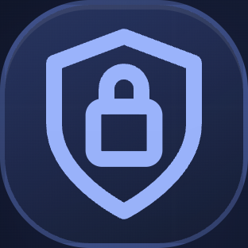

# OTP-Shelter

!

A self-hosted TOTP authenticator designed to keep your codes under your
control.

OTP-Shelter provides a clean and private interface for managing your
TOTP accounts while keeping the encrypted vault under your control.

------------------------------------------------------------------------

## Why OTP-Shelter?

OTP-Shelter was built around a simple idea:

**Your codes. Your sovereignty.**

Your TOTP accounts are stored inside an encrypted vault protected by
your master password.

The project is lightweight, self-hosted and designed to run on your own
infrastructure without depending on a third-party authentication
service.

------------------------------------------------------------------------

## Features

-   🔐 Encrypted TOTP vault
-   AES-256-GCM encryption
-   scrypt-based key derivation
-   TOTP generation
-   SHA-1, SHA-256 and SHA-512
-   6 or 8 digit codes
-   Configurable TOTP periods
-   Add accounts using `otpauth://` URIs
-   Search accounts
-   Hide and show codes
-   One-click code copying
-   Edit and remove accounts
-   Automatic session expiration
-   Login rate limiting
-   Encrypted backup and restore
-   Master password change
-   Lightweight and responsive
-   Self-hosted

------------------------------------------------------------------------

## Screenshot

``{=html}

------------------------------------------------------------------------

## Security

OTP-Shelter stores your TOTP accounts inside an encrypted vault.

The vault uses:

-   AES-256-GCM for authenticated encryption
-   scrypt for password-based key derivation
-   Random salts
-   Random encryption IVs
-   Server-side authenticated sessions
-   HTTP-only session cookies
-   Login rate limiting

The master password is never stored.

The TOTP secrets are kept inside the encrypted vault and are not
returned as part of the normal account listing.

> Keep your master password safe. If it is lost, the vault cannot be
> recovered without it.

------------------------------------------------------------------------

## Installation

Clone the repository:

``` bash
git clone https://github.com/egzola/otp-shelter.git
cd otp-shelter
```

Install dependencies:

``` bash
npm install
```

Start the application:

``` bash
npm start
```

Open:

``` text
http://127.0.0.1:3010
```

On the first launch, create your master password and initialize the
vault.

------------------------------------------------------------------------

## Usage

1.  Create your master password
2.  Unlock OTP-Shelter
3.  Add a TOTP account
4.  Scan or paste an `otpauth://` URI
5.  Copy your authentication code when needed
6.  Manage your accounts from the vault

------------------------------------------------------------------------

## Backups

OTP-Shelter supports encrypted vault backups.

Export your encrypted backup from the application and keep it somewhere
secure.

Backups can be imported into another OTP-Shelter installation.

No plaintext TOTP secrets are required for the backup process.

------------------------------------------------------------------------

## TOTP Compatibility

OTP-Shelter supports standard:

``` text
otpauth://totp/...
```

provisioning URIs.

Supported algorithms:

-   SHA-1
-   SHA-256
-   SHA-512

Supported code lengths:

-   6 digits
-   8 digits

Configurable periods are also supported.

------------------------------------------------------------------------

## Self-Hosting

OTP-Shelter is designed to run on your own machine, server or home lab.

It can also be placed behind a reverse proxy such as Caddy or Nginx.

For internet-facing deployments, HTTPS and proper server/network
security are strongly recommended.

------------------------------------------------------------------------

## Design Principles

-   Private by default
-   Self-hosted
-   Simple over complex
-   Secure over convenient
-   Lightweight
-   No unnecessary dependencies
-   Your infrastructure, your vault

------------------------------------------------------------------------

## Developer

egzola

GitHub\
https://github.com/egzola

------------------------------------------------------------------------

## License

MIT
